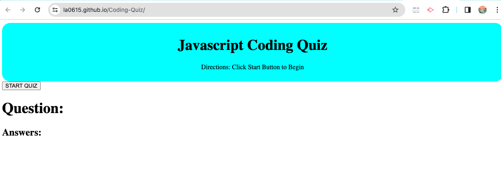

# Coding-Quiz# 

## Description

Provide a short description explaining the what, why, and how of your project. Use the following questions as a guide:

This quiz was created to practice using basic HTML and CSS, while being able to use most of the code with Javascript. This was to practice usinga  timer, functions, for loops, arrays, and using local storage to display high scores after the quiz was complete multiple times. 


## Installation

N/A

## Usage

Click START to begin the quiz. Your score will be saved each time you complete the quiz. 

To add a screenshot, create an `assets/images` folder in your repository and upload your screenshot to it. Then, using the relative filepath, add it to your README using the following syntax:

    ```md
    
    ```


